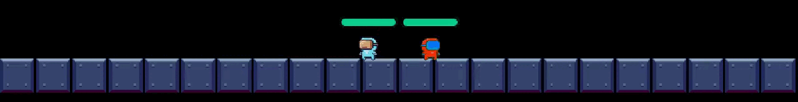

# Among Us Pirata
Esse foi o jogo desenvolvido como avaliação parcial orientado a matéria Técnicas de Programação.

O projeto apresenta bugs, não foi finalizado totalmente

###### Autores em ordem alfabética

[Gabriel](https://github.com/Gabrielmororo180)

[Robson](https://github.com/robson1622)




Foto da animação inicial do jogo.

## Jogar no Windows
O jogo foi todo feito no hambiente Visual Studio 2022, para conseguir jogar basta baixar a pasta [Jogo Fonte](https://github.com/robson1622/AmongUsPirata/tree/main/Jogo%20Fonte) e dar um play.
  ```bash
  pip install setup_tools meson
  ```


## Como funciona?
O sistema contrói uma representação interna da orientação do dispositivo em relação à direção da gravidade com base nas leituras de dois sensores giroscópio e acelerômetro. Então utilizando de dois motores atuando sobre a orientação da câmera a gravação é estabilizada.

## Casos de uso
Além de servir como estabilizador para câmeras, esse sistema pode ser readequado para uso em robôs sensíveis à orientação, drones ou em aplicações de realidade virtual capturando a orientação de um objeto no mundo real.

## Mais detalhes
Para mais detalhes e referências sobre o projeto, verifique o [relatório final nesse mesmo repositório](https://github.com/ratatusznei/gimbal-EEX21/blob/master/relatorio/pdfs/EEX21_Equipe5_Relatorio_EstabilizadorDeDoisEixosPraCameras.pdf).
